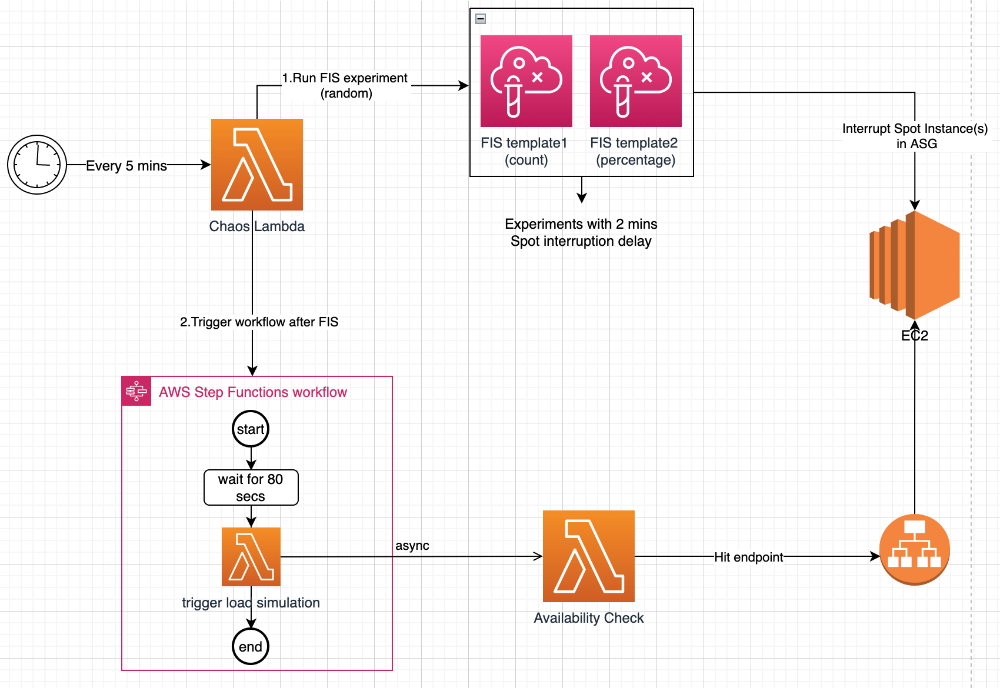

# Amazon EC2 Spot interruption simulation with AWS Fault Injection Simulator - Automation

This sample provides end to end automation of EC2 Spot Interruption simulation with application availability testing during Spot interruption. This uses AWS Fault Injection Simulator(FIS), Lambda(Python Runtime) and Step Function workflow 
for end to end automation.

This sample can be deployed with CloudFormation Template provided.

# Architecture/Flow Diagram:

## Why was this sample solution developed?
To test or simulate application availability during EC2 Spot interruption, one need to synchronise timing of Spot interruption with sending load to the end point that is running in Spot instance. i.e. to send HTTP requests continuously such a way that it overlaps with the instance interruption duration and validate if connection draining, target de-registration are happening, in-flight requests are completed in time. Manually performing these are time-consuming and not scalable when we have multiple services.

## Scenario & Problem
With Oct 2021 release of support for Spot Interruption with FIS, users can now simulate Spot interruption in simple and straight forward way to test/validate their workload for Spot Interruption tolerance. With FIS it is easy to interrupt EC2 instances (based on count or percentage of running instances), but one has to manually perform sync time of EC2 Spot interruption with time of requests sent through load testing.

### Approach to solve the problem
This sample solution has workflow that triggers FIS experiments and then sends HTTP requests at right time and validates responses to find out if setup is correct, workload is fault/interruption tolerant. This marks test as failed if there are 5xx errors that are returned during the testing (this assumes you have configured sufficient capacity for the load you are sending and 5xx error are related to failing in-flight requests)
This sample solution helps with simulation and sync as mentioned in architecture diagram above. You may need to adjust/fine tune parameters used in CloudFormation and Lambda function to match your use case.

### Use Cases where this can be used
This can be used for workloads like web based app / web services. Also, this can be extended or modified to suite other types of workloads like batch application.

### Installation & Run
Pre requisites:
* Python 3.8
* pip3
* s3 bucket to store and refer lambda source package

Packaging & Installation:
1) Create S3 bucket(block public access) in your AWS account. Optionally you can use existing S3 bucket.
2) Download this source in to your system
3) cd to lambda/package folder and execute package.sh
4) Upload generated lambda zip file from root of this package to S3
5) Deploy CloudFormation template from templates folder. Provide parameters - SpotASG, AssetsBucket and AssetsKeyPrefix.
6) Set environment variable APP_URL in trigger_load lambda function 

#### Note:
1) Fine tune load parameters in of function avail_check_score() in availability_check.py based on your requirement
2) If needed, customize http request creation in open_url() function in availability_check.py  
3) During Spot Interruption, if in-flight requests gets completed in few milliseconds, you may not have successful simulation. In such case you may need to adjust load simulation for your http endpoint   Optionally test with sample app that has some waits in the code or test with a request that takes few seconds.

### References
https://aws.amazon.com/about-aws/whats-new/2021/10/aws-fault-injection-simulator-injects-spot-instance-interruptions/

### Security

See [CONTRIBUTING](CONTRIBUTING.md#security-issue-notifications) for more information.

## License

This library is licensed under the MIT-0 License. See the LICENSE file.